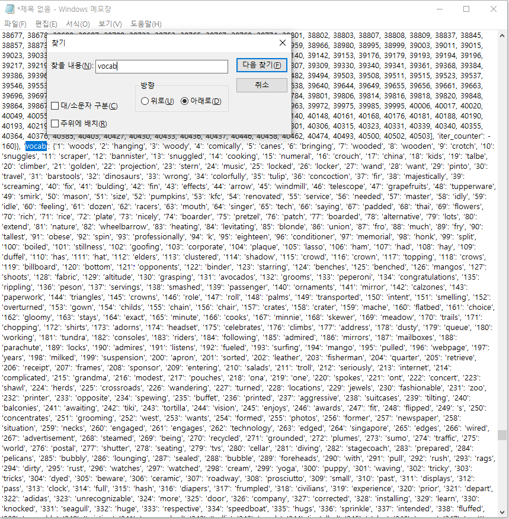
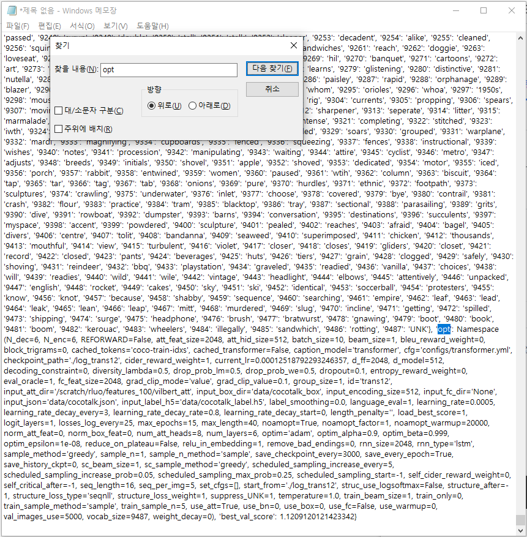
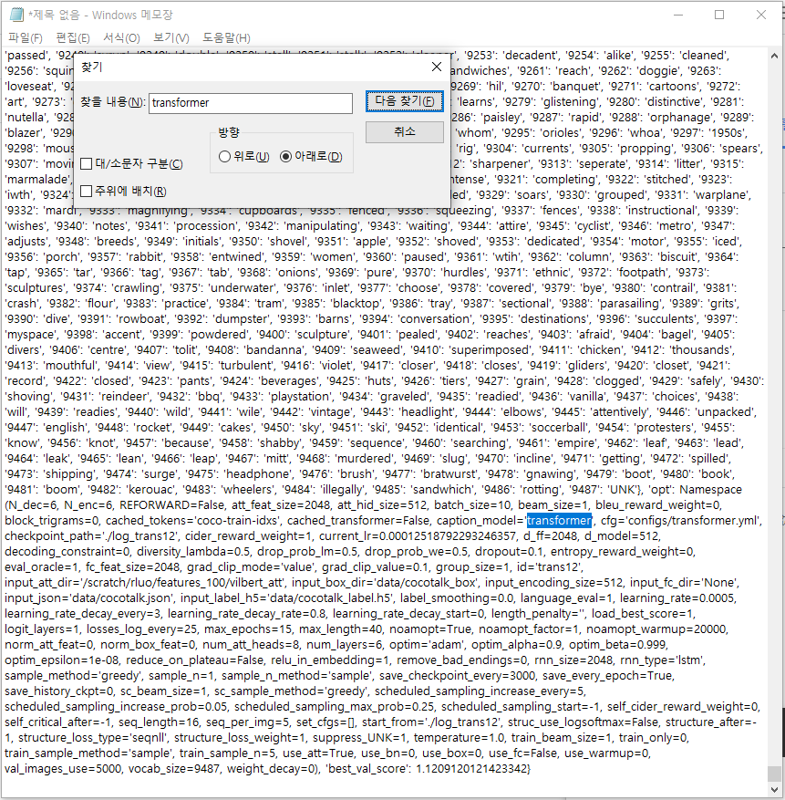
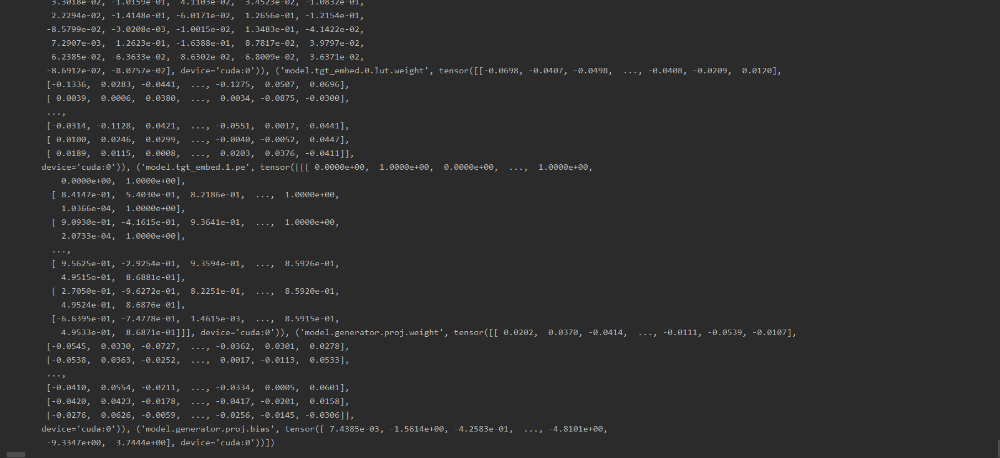

# 0318


## DONE


#### 1. SUB 1 명세서 Req 2의 이해

1. Caption_model() 생성

```python
# image_captioning.py main

if __name__ == '__main__':
    caption_model = Caption_Model()
```

1. 1 Caption_model()  \__init__

>Caption_model 객체 생성시 FeatureExtractor 객체 생성과 함께 captioning을 위한 모델을 불러오기 위해 load_model() 내장 함수가 실행된다.

```python
# image_captioning.py

class Caption_Model:
    def __init__(self):
        self.base_dir = os.path.dirname(os.path.dirname(__file__))
        self.feature_extractor = FeatureExtractor()
        self.load_model()
```

1. 2 FeatureExtractor() \__init__

> FeatureExtractor 객체 생성시 _build_detection_model() 함수를 통해 미리 다운 받았던 feature를 추출할 수 있는 model를 불러온다.

```python
# image_captioning.py

class FeatureExtractor:
  TARGET_IMAGE_SIZE = [448, 448]
  CHANNEL_MEAN = [0.485, 0.456, 0.406]
  CHANNEL_STD = [0.229, 0.224, 0.225]
  
  def __init__(self):
    # self._init_processors()
    self.base_dir = os.path.dirname(os.path.dirname(__file__))
    self.detection_model = self._build_detection_model()
```

1. 3 _build_detection_model() 함수

>경로상에 detectron_model에 관한 변수 설정이 들어있는 파일을 읽고 학습된 detectron_model.pth에서 키값이 'model'인 값을 추출하여 model에 불러오고 이를 gpu셋팅과 평가하는 model로 변환한 후 반환해준다.

```python
# image_captioning.py FeatureExtractor class

  def _build_detection_model(self):

      # detectron_model.yaml의 주소
      cfg.merge_from_file('{your project path}\\speak_image\\IC\\model_data\\detectron_model.yaml')
      cfg.freeze()

      model = build_detection_model(cfg)
      # detectron_model.pth의 주소
      checkpoint = torch.load('{path}\\detectron_model.pth',
                              map_location=torch.device("cuda"))

      load_state_dict(model, checkpoint.pop("model"))

      model.to("cuda")
      model.eval()
      return model
```

1. 4  Caption_Model의 load_model() 함수

>FeatureExtractor 객체를 생성했으면 load_model()을 통해 Caption_Model에서 captioning을 담당할 모델을 불러와야 한다.
>
>infos_trans12-best.pkl 을 디코딩해서 살펴보면 데이터들의 텐서 값과 인덱싱된 vocab 데이터, 'opt'키값에 대한 captioning모델 구조가 들어있다.
>
>pickle 파일을 읽어온 객체 infos에서 opt에는 vocab 데이터가 없기에 따로 추가해주고 gpu사용으로 셋팅해준다.
>
>그리고  학습된 모델의 weights와 bias가 저장된 model-best.pth라는 파일을 읽어와 모델에 적용시켜준다.

```python
# image_captioning.py Caption_Model class

    def load_model(self):
        # infos_trans12-best.pkl의 주소
        infos = captioning.utils.misc.pickle_load(open('{path}\\infos_trans12-best.pkl', 'rb'))
        infos['opt'].vocab = infos['vocab']
    
        self.model = captioning.models.setup(infos['opt'])
        self.model.cuda()
        self.model.load_state_dict(torch.load('{path}\\model-best.pth'))
```

> infos_trans12-best.pkl  에서 vocab부분



> infos_trans12-best.pkl  에서 opt부분



> infos_trans12-best.pkl  에서 caption_model 부분



> model-best.pth 에 저장된 weight와 bias 텐서들




2. Caption_Model 객체의 inference(image_url) 함수를 통한 image_captioning 

```python
# image_captioning.py main

if __name__ == '__main__':
    caption_model = Caption_Model()
    image_url = 'soccer.jpg'
    img = cv2.imread(image_url, cv2.IMREAD_COLOR)
    
    result = caption_model.inference(image_url)
    
    print(result)
    cv2.imshow("image", img)
    cv2.waitKey(0)
    cv2.destroyAllWindows()
    pass
```

2. 2 inference() 함수

>Caption_Model에 생성시 만든 FeatureExtractor 객체를 통해 이미지의 특징을 불러오고
>
>이를 captioning model을 통해 디코딩 과정을 거쳐 만들어진 문장들을 반환한다.

```python
# image_captioning.py Caption_Model class

    def inference(self,img_feature):
        img_feature = self.feature_extractor(img_feature)
        # Return the 5 captions from beam serach with beam size 5
        return self.model.decode_sequence(self.model(img_feature.mean(0)[None], img_feature[None], mode='sample', 
                                                     opt={'beam_size':5, 'sample_method':'beam_search', 'sample_n':5})[0])
```

2. 3 FeatureExtractor 클래스의 \__call__

> \__call__ (): python에서 객체 생성 이우 해당 객체 호출 시 사용되는 함수
>
> 위의 inference과정에서 생성된 FeatureExtractor 객체에 파라미터로 image_url 입력시 아래의 함수가 실행되면서 이미지의 특징을 추출한다.

```python
# image_captioning.py FeatureExtractor class

  def __call__(self, url):
    with torch.no_grad():
      detectron_features = self.get_detectron_features(url)
```

2. 4 get_detectron_features() 함수

> 이미지를 불러오면서 스케일링을 바꿔주고 FeatureExtractor 생성시 불러온 dection_model을 사용해 이미지의 특징을 추출해 반환해준다.

```python
# image_captioning.py FeatureExtractor class

  def get_detectron_features(self, image_path):
      im, im_scale = self._image_transform(image_path)
      img_tensor, im_scales = [im], [im_scale]
      current_img_list = to_image_list(img_tensor, size_divisible=32)
      current_img_list = current_img_list.to('cuda')
      with torch.no_grad():
          output = self.detection_model(current_img_list)
      feat_list = self._process_feature_extraction(output, im_scales, 
                                                  'fc6', 0.2)
      return feat_list[0]
```

3. 위와 같은 과정을 거쳐 아래의 사진과 같은 결과를 얻게 된다.


#### 2. Sub2 Req2, Req3 문의

참고자료를 통해 train.py를 작성하고 실제 실행시키면서 생긴 의문점 2가지를 컨설턴트님께 여쭤봄.

1. train 속도
2. validation 과정에서 적절한 loss 값

참고한 사이트

https://github.com/NVIDIA/DeepLearningExamples/blob/master/PyTorch/SpeechSynthesis/Tacotron2/train.py


## TODO

#### 1. 3/19에 있는 발표 ppt 자료 조사

#### 2. tacotron.py 작성후 테스트하기


