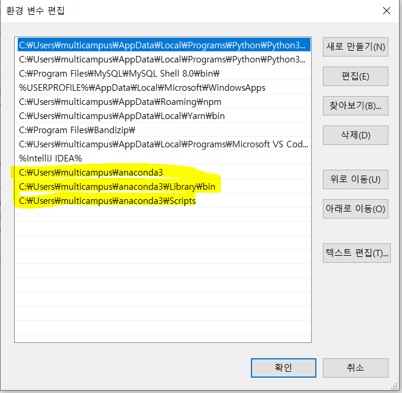
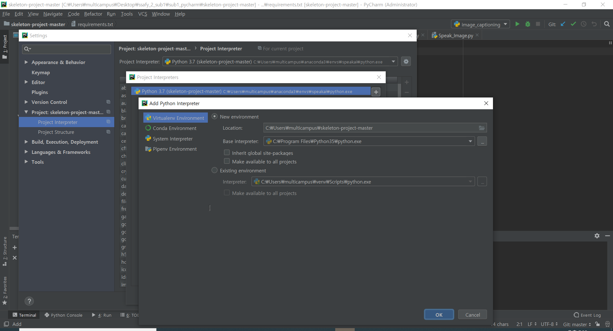
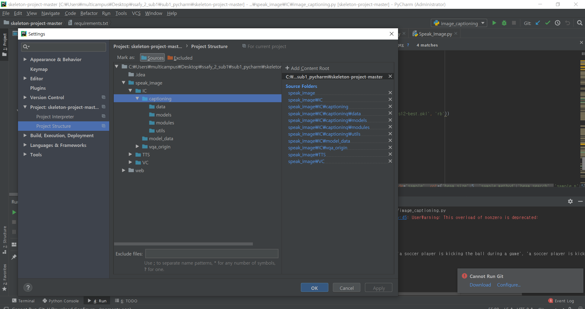

# 특화프로젝트 AI 사진 읽어주는 인공지능

## sub1 스켈레톤 코드 실행해보기

#### 1. install anaconda
> https://www.anaconda.com/products/individual

#### 2. environment variable for anaconda


#### 3. create conda virtual environment
```
conda create -n [NAME] python=3.7
```

#### 4. activate virtual environment
```
conda activate [NAME]
```

#### 5. install framework and library on virtual environment
```
conda install pytorch=1.7.0 torchvision torchaudio cudatoolkit=10.1 -c pytorch
```
> skeleton code에서 사용되는 pytorch 버전이 1.7.0이기에 명시해서 설치하기

```
pip install tensorflow-gpu==2.3.1
```
> pip으로 설치할 때 버전을 명시해 주려면 '=' 대신 '=='을 사용하여 설치하기

```
pip install pyyaml==5.3.1
pip install yacs==0.1.8
pip install opencv-contrib-python==4.4.0.46
pip install requests==2.25.0
pip install librosa==0.6.3
```
> 해당 library는 requirements.txt 를 사용하여 설치할 때 제대로 안되는 경우가 있어서 따로 설치하기

#### 6. clone skeleton code from ssafy git and download pre trained model
```
git clone https://lab.ssafy.com/s04-ai-speech-sub1/skeleton-project.git
```
download: [detectron pre-trained model](https://drive.google.com/file/d/1A6S00G5uRtDYWrtB32QP5KkpYrgHBR68/view)

download:  [vocab](https://drive.google.com/file/d/13hJT7MV2K3ugC4gPE9hTvVR3PyuJzC67/view)

download:  [captioning pre-trained model](https://drive.google.com/file/d/1AZx47VgVLv58JtSe_FnWPSKfx88G72iS/view)

#### 7. setting up conda virtual environment python in interpreter
> File >> Settings >> Project:[Project Name] >> Project Interpreter >> add virtual environment python.exe


> File >> Settings >> Project:[Project Name] >> Project Structure >> add directory content


#### 8. write and install requirements.txt
> move directory to ./speak_image/IC
```
pyyaml==5.3.1
yacs==0.1.8
opencv-contrib-python==4.4.0.46
requests==2.25.0
```

```
pip install -r requirements.txt
```

#### 9. create build file
> move directory to ./speak_image/IC/vqa_origin
```
python setup.py build develop
```
> check _C.cp37-win_amd64.pyd at ./speak_image/IC/vqa_origin/maskrcnn-benchmark <br/> if it is not working, install c++ 14 or higher version of compiler

#### 10. complete image_captioning.py
> #1 create Caption_Model instance <br/> #2 define image url <br/> #3 load image using cv2.imread() <br/> #4 print caption that is resulted by Caption_Model's inference function <br/> #5 print image using cv2.imshow()

#### 11. run iamge_captiong.py


#### 12. solve error
> 1. transformer not found error
```
conda install -c huggingface transformers
pip install git+https://github.com/ruotianluo/meshed-memory-transformer.git
```

> 2. numpy 1.19.2 version mismatch error
```
pip uninstall numpy
pip install numpy==1.19.3
```


