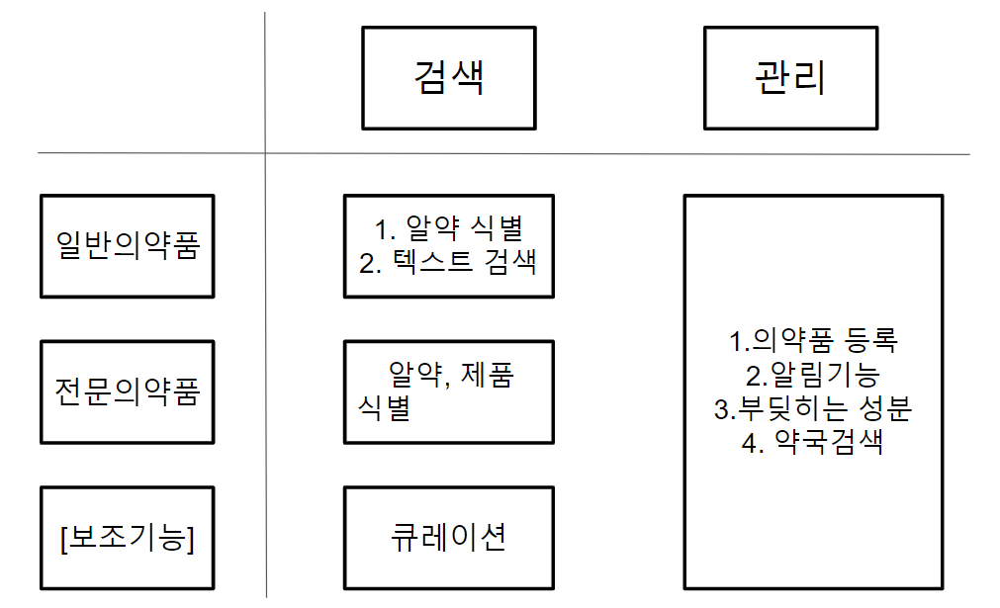
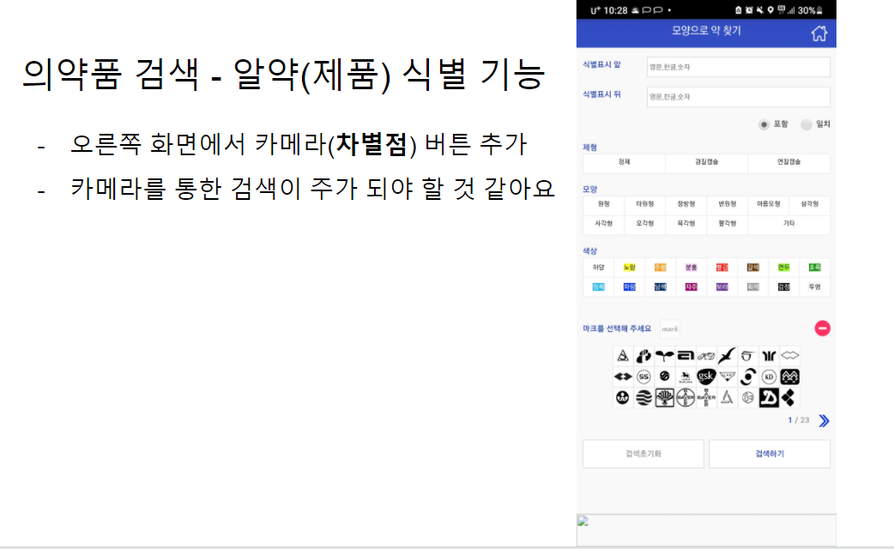
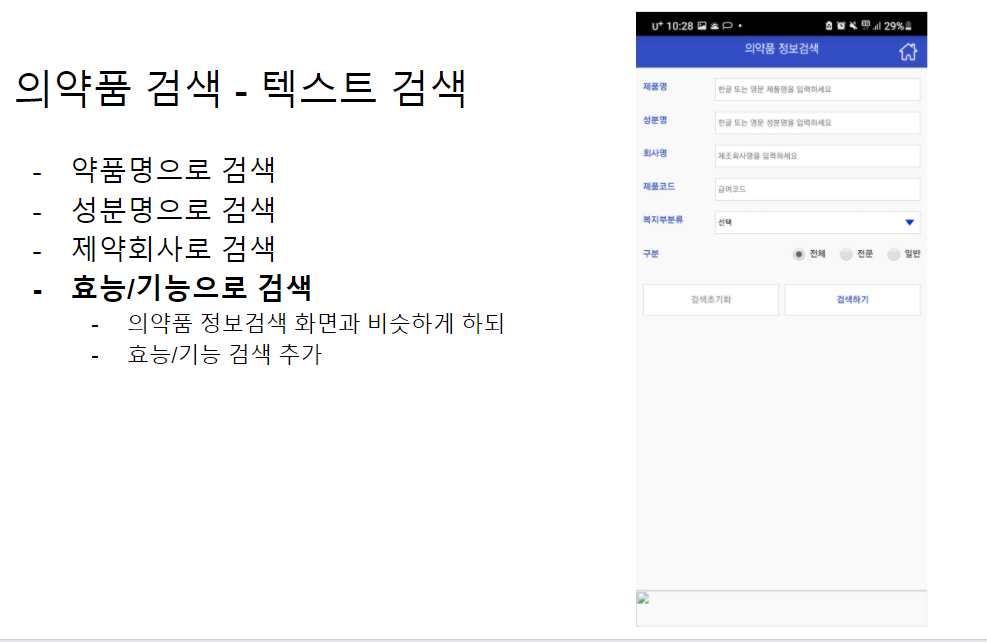
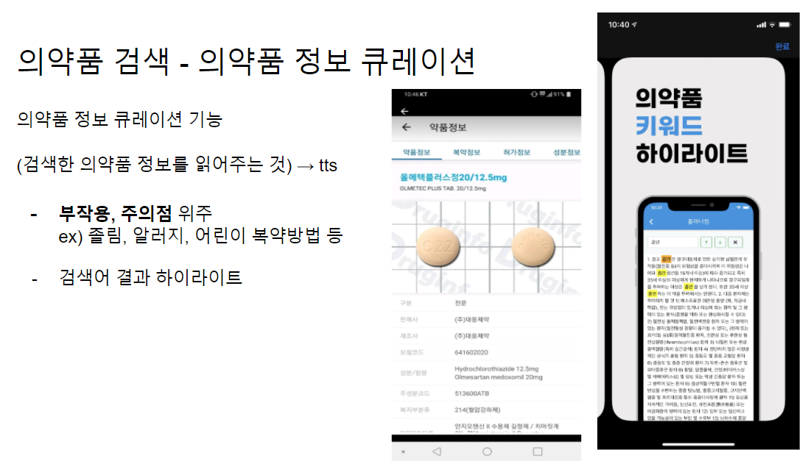
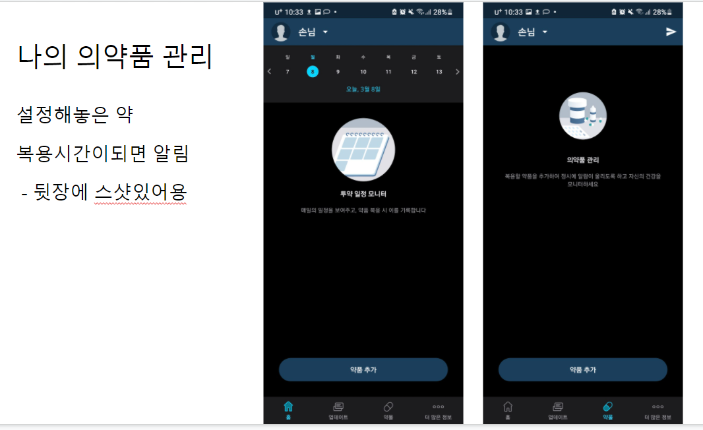
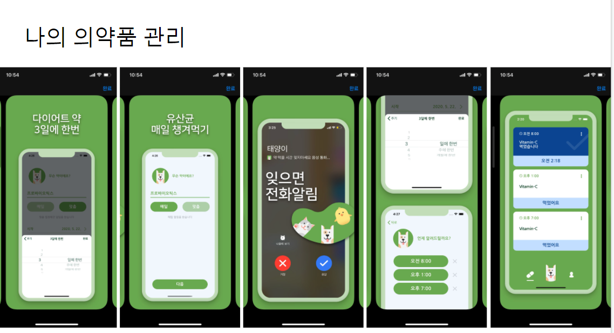
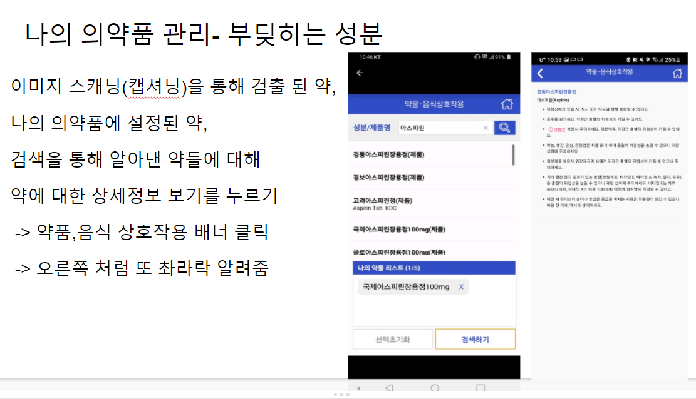
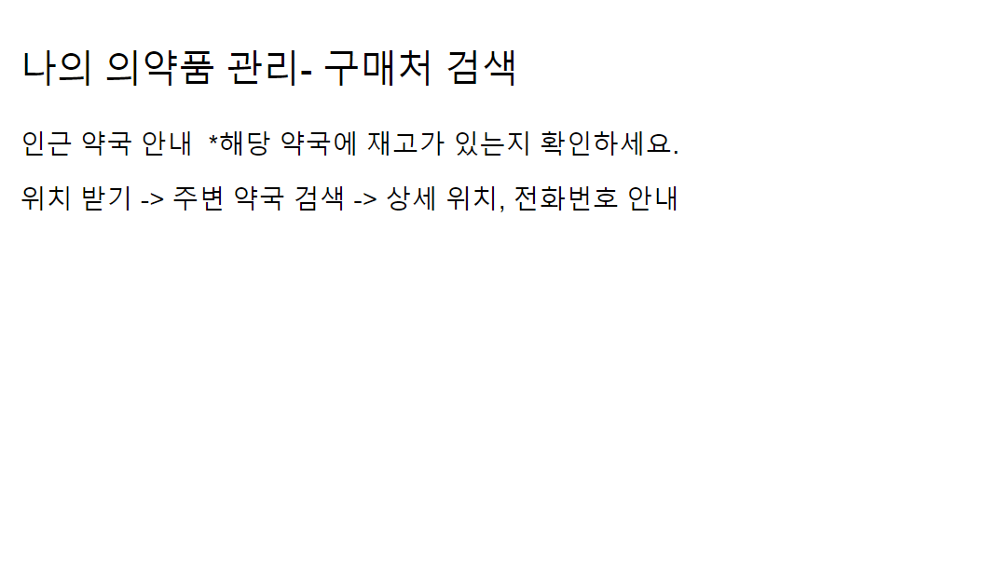

# 기능요약

> `강약중강약` 서비스의 기능을 정리한다. 자세한 것은 [공유문서](https://docs.google.com/presentation/d/1GB4DtBJ-vID0TGbIiIzEWNbeom-pLPQiUa_u2PIP8Eg/edit#slide=id.p)를 참고한다.

2021.03.08

---

[TOC]

---

**기능 정리**

## 1. 검색 기능

### 1.1 알약(제품) 식별 기능

### 1.2 텍스트 검색

- 어플이름: 의학품 검색 (약학정보원)

### 1.3 정보 큐레이션

- [처방전 스캔] image_captioning 안쓰려면 추출된 결과로 문장을 만드는 알고리즘을 넣어야 할 듯
  - ex) “어떤 의약품이 몇개 있다”를 캡셔닝 해야하는데 어려우니까 인식만 하고 db에서 정보 가져와서 문장 만드는 형태?

## 2. 관리 기능

### 2.1 의약품 등록

**참고 어플**

- 어플 이름: medisafe
  - 기능: 수동으로 약품을 등록하면 복용시기에 푸시 알림을 주는 어플 (단, 수동 입력)
- 참고) 어플 이름: My therapy
  - 기능: 약품 복용시기 알림. 체중, 혈압, 운동 등 및 해당 데이터로 의사와 공유 (단, 수동 입력)

### 2.2 복용 알림

- 어플이름: 약 알림 태양이 - 디자인 참플이름: 약 알림 태양이 - 디자인 참고!!

### 2.3 부딪히는 성분 안내

**위의 참고 어플**

- 어플명: medisafe
  - 기능: 수동으로 약품을 등록하면 복용시기에 푸시 알림을 주는 어플 (단, 수동 입력)

### 2.4 주변 약국 안내

- 약국 위치 검색 관련 api 있는지 확인. (없다면 카카오맵 api에서 검색 기능 써도 될 듯)

## 3. 고도화 계획

- 커뮤니티
- 처방전 인식해서 복용알람 자동 설정
- 등록 의약품 및 스케줄러 담당의사선생님과 연결