# 와이어프레임

> 기획 서비스의 와이어프레임을 작성하였다. [oven 페이지](https://ovenapp.io/view/L6hgw6WZoPtGOBgCAgxlr0kQGfyxcsYa/q983k) 참고!
>

2021.03.08

---

[TOC]

---

## 1. Character

- 알약 모양의 캐릭터 활용

## 2. Concept Color

- 색상
- 차분하고 연한 파란색 계통의 색상
  - 신뢰감 상승
  - 친근감 상승

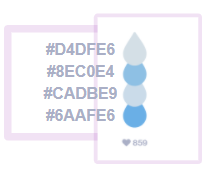

## 3. 검색 기능

### 3.1 메인 화면

- 검색 기능 메인 화면에서는 3가지 검색 방법 혹은 근처 약국을 확인하는 페이지로 이동할 수 있다.

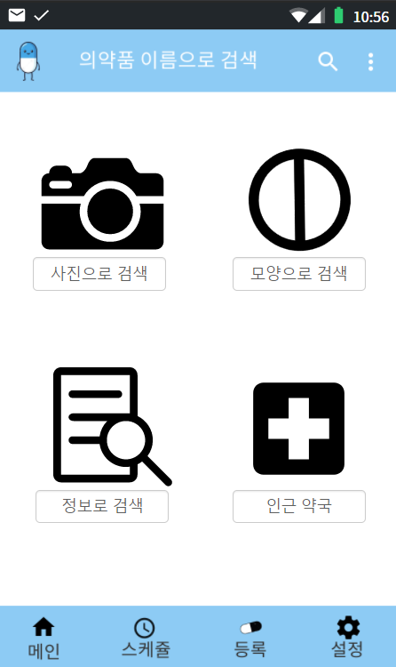

### 3.2 사진으로 검색

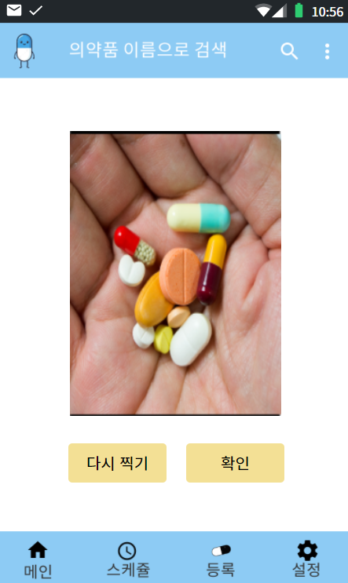

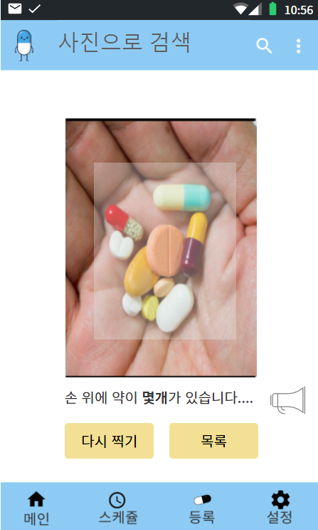

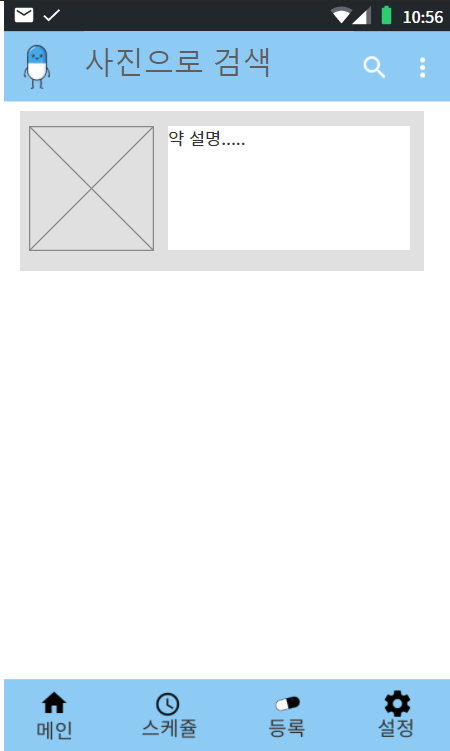

### 3.3 모양으로 검색

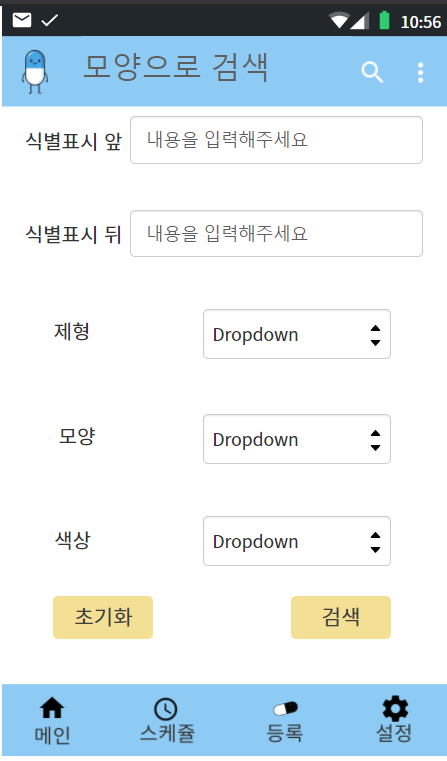

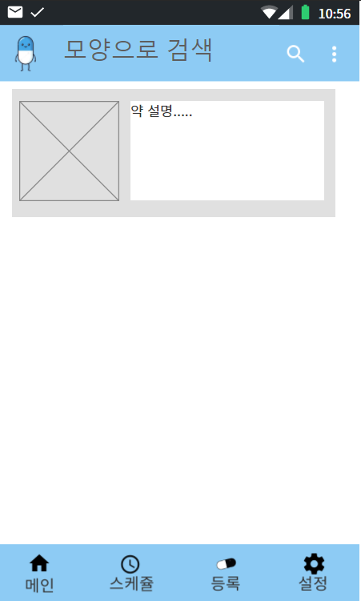

### 3.4 정보로 검색

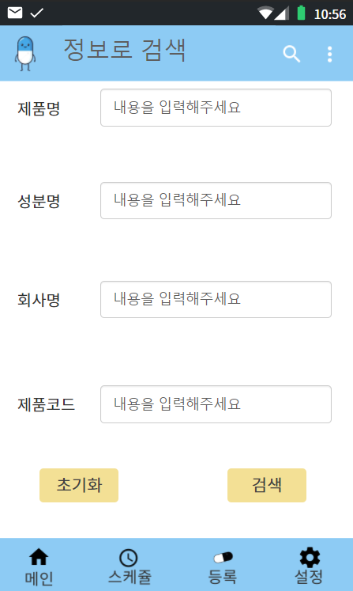

### 3.5 의약품 정보

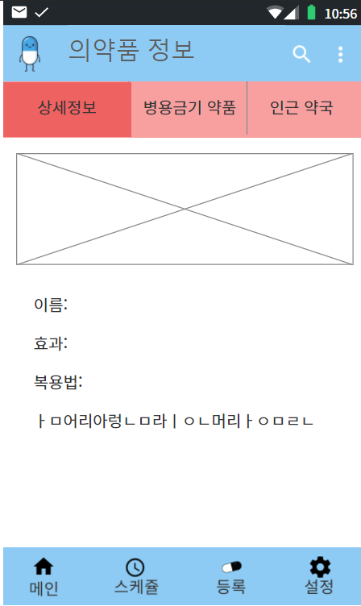

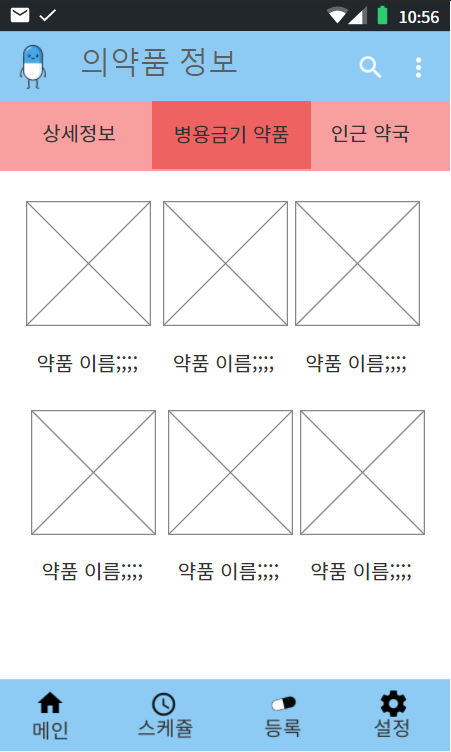

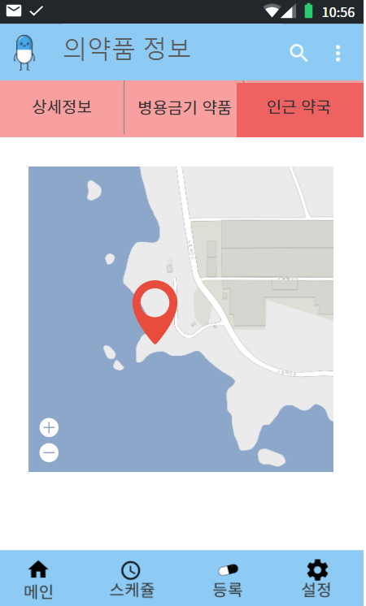

## 4. 관리 기능

### 4.1 의약품 관리

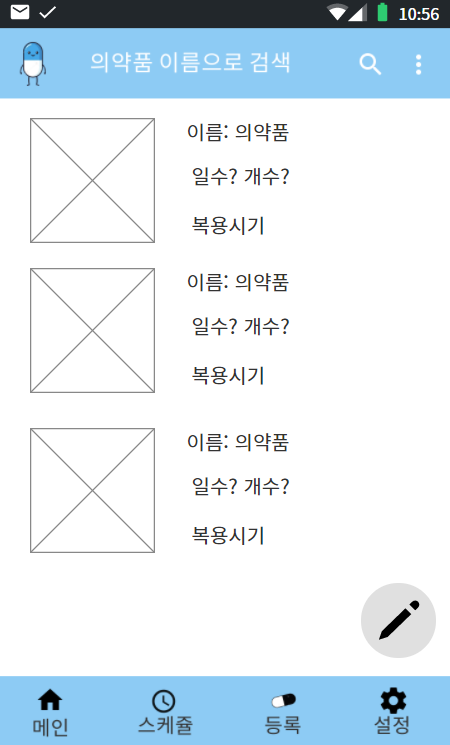

### 4.2 의약품 등록

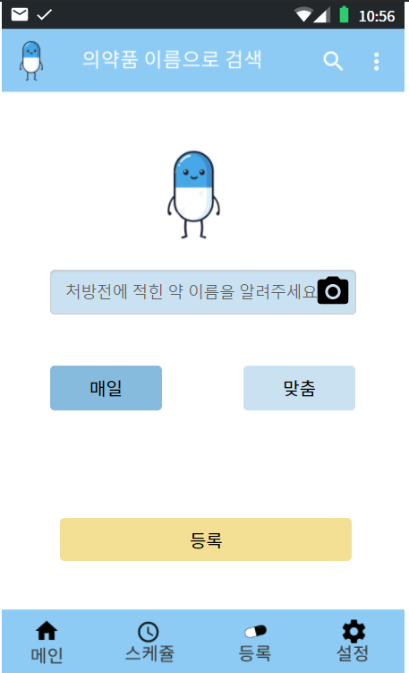

### 4.3 내 의약품 상세

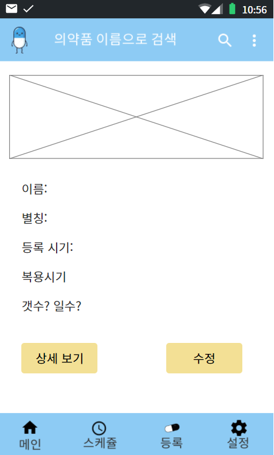

### 4.4 알람기능

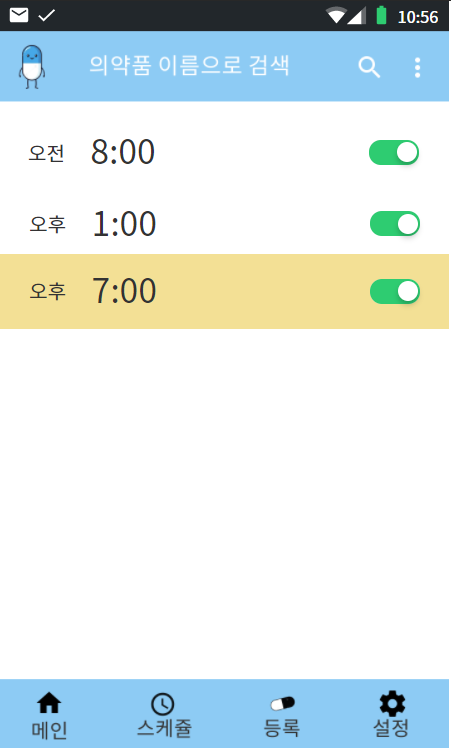

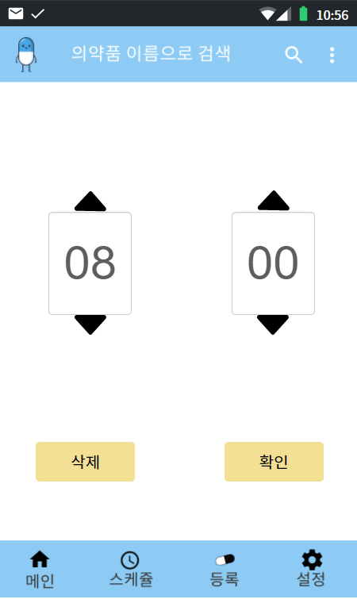

## 5. 부가 기능

### 5.1 일반/확대모드

- 저시력자를 위한 확대모드를 제공한다.
- 어플 최초 실행시 선택할 수 있으며, 이후에는 설정에서 재선택할 수 있다.

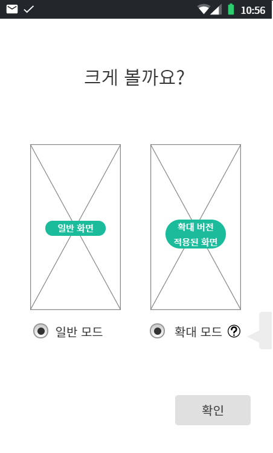

### 5.2 환경설정

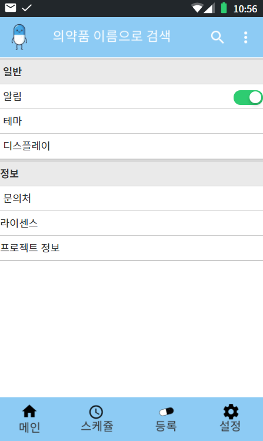

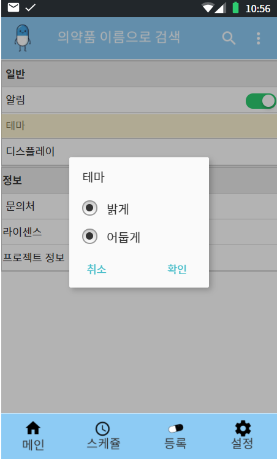

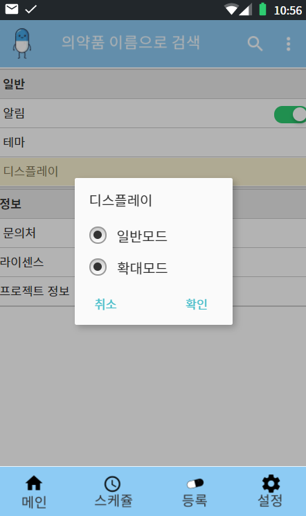

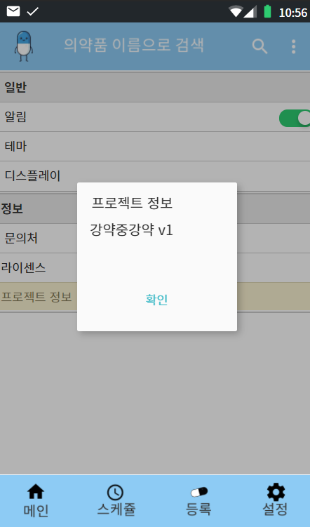