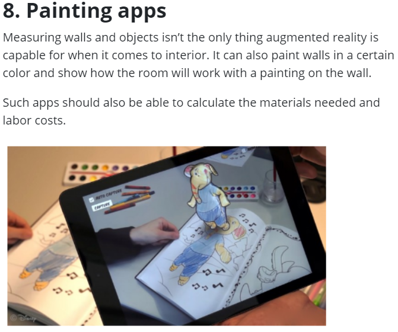
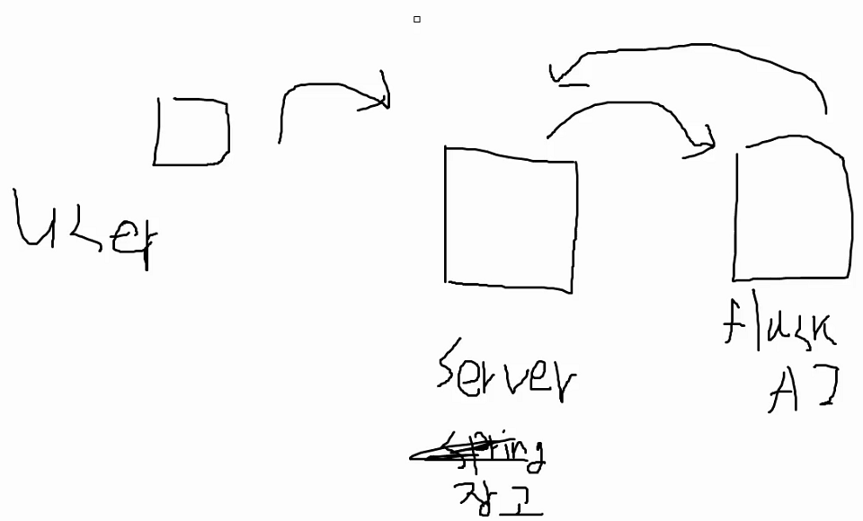

# 2주차 회의록

> 특화프로젝트 2주차 기간 동안 회의했던 내용들을 정리한다.

---

[TOC]

---


## 0308(월) - 기능정리 및 와이어프레임

---

- 주제: 기능정리, 와이어프레임 작성
- 일시: 2021년 3월 8일 10:00 - 18:00
- 회의 참석자: 5명 전원

---

> 자세한 내용은 아래의 [기능요약 문서](../기획/기능요약.md)와 [와이어프레임 문서](../와이어프레임/와이어프레임.md)를 참조한다.

**공지사항**

- 팀장 미팅 - **Git, Jira 관리**하는 법 익히기
  - Git은 어떻게 하면 날라가는지/안 날라가는지 배우는 것이 중요
  - Jira는 안 써도 프로젝트 진행이 가능함.
  - 그러나 제대로 배워두면 면접 때 좋게 봄.
  - Jira에서 **스토리포인트**까지 관리하도록!
- **내일 10시에 컨설턴트님과 팀 미팅**!

**주제**

⭐ 기능 정리

⭐ 와이어프레임 작성

**내용**

- ⭐ 지향점 ⭐
  - 내 의약품 관리에 focus!
    - 내가 먹고 있는 약에 대해서 알 수 있음! ☑️
    - 알람 기능
  - 저시력자를 위한 point!
    - 원활하게 알약을 복용할 수 있도록 aid
- Display Zoom 기능
  - standard와 zoomed로 선택할 수 있게한다.
  - `class` / `id` 값으로 분기를 나누어서 설정!

**할일**

- [x]  11시 팀미팅 일정 신청
  - [x]  담당자: 이규용
- [x]  git/jira/mm 연결하기
  - [x]  담당자: 윤서완
- [x]  오후에는 디자인 큰 틀, 색상, 와이어프레임 작성

**질문거리**

- 알약 한 번에 "여러 개" 인식하는 기능을 넣어도 괜찮을지?


## 0309(화) - 와이어프레임

---

- 주제: 와이어프레임 작성
- 일시: 2021년 3월 9일 9:10 - 18:00
- 회의 참석자: 5명 전원

---

> 자세한 내용은 아래의 [기능요약 문서](../기획/기능요약.md)와 [와이어프레임 문서](../와이어프레임/와이어프레임.md)를 참조한다.

**주제**

- 주간 계획 수립 및 파트별 `jira` 작성
- 와이어프레임 작성
- 기획단계에서는 매시 50분에 10분간 휴식시간 꼭 가지는 것으로!!

**컨설턴트님 피드백**

- 프로젝트 volumne이 너무 적다
  - **AR** 같은 것을 도입해보면 어떨까?
  - `와`우 할 만한 서비스를 더 기획해보는 것은 어떨지?
- Q. 왜 하이브리드 앱을 추천하셨는지?
  - 경험 부족, 웹 개발에 익숙하므로 하이브리드 추천
  - 물론 안드로이드 앱이 더 좋지만, 우리 서비스에서는 하이브리드로도 충분했다고 판단
- Q. 알약 한 번에 "여러 개" 인식하는 기능을 넣어도 괜찮을지?
  - 검색이면 **하나씩** 하는게 좋음!
- 정확도 문제 때문에 잘못된 약을 복용하게 된다면?
  - 이것에 대한 설명을 충분히 할 수 있어야할 것 같다.
- ❗사용자가 사진을 찍어서 얼굴 나이를 인식하여 `일반/확대모드`를 추천해주는 서비스를 도입하면 어떨까?
- 와이어프레임을 보니 생각보다 페이지가 많다!
  - [규용팀장] 이미지처리 1명, 백엔드 2명, 프론트엔드2명
    - [규용팀장] 안드로이드 앱 개발하면 아마 프론트 3명이 붙어야하지 않을까.

**내용**

- 약 검색을 한 번에 

  ```
  하나 or 여러 개
  ```

   할 것인지?

  - [송여이] 저는 하나!
  - [규요이] 1개짜리를 먼저 하고, 여러개는 추후 고도화하는 것이 어떨지?
  - [과반수] 좋습니다!!
  - [규요이] 모두 대답 안해주시면 저 안 넘어갈께예여~~~~~
  - [성후이, 형차이] 예에~

- 안드로이드 

  ```
  네이티브 or 하이브리드
  ```

  ?

  - 네이티브: 학습목표에 부합
  - 하이브리드: 프로젝트 추진력에 부합
  - ☑️ **하이브리드로 땅땅!!**

- 역할 분담?

  - [규용팀장] 프론트가 작업량이 많기 때문에, 백엔드 하는 사람이 AI를 하면 좋을 것 같다.

- 현 프로젝트를 자율까지 이어서 할 것인지?

  - [만장일치] 아니요!
  - [형차이] 자율 프로젝트 때는 그냥 공부하며 워라밸할 예정!
  - [성후이] 아 미안미안 딴 거 보고 있어서(안 듣고 있었음...)
    - (그냥 관심이 없는듯...ㅠㅠㅠ)

- 동물 의약품도 추가할까?

  - 우선 DB table을 생성해놓고, 나중에 시간이 되면 구축한다.

- ☑️ DB는 mySQL 사용

**주제 방향 논의**

4팀! 노인복지 프로젝트에 약품관리 관련된 서비스가 존재한다.

- 형창: 아이디어 바꾸기가 너무 귀찮다.
- 서완: 그냥 지금대로 해도 괜찮을 것 같다.
- 규용: 우리가 스트레스 안 받을 정도로 겹치면 괜찮지만
  - `동물 약`도 추가하면?
- 성훈: 4팀한테 안 잡아먹힐 정도로! (어른들을 복잡한 걸 싫어한다...)

**개발환경**

- 웹뷰 백엔드 - `Django`
- 머신러닝 라이브러리 - `Tensorflow`
- 안드로이드(앱 만들 때) - `Java`?

**역할분담**

- FE (디자인 - 템플릿 사용)
  - 이규용

서완

- [ ]  안드로이드 스튜디오 설치
- [ ]  안드로이드 스튜디오 환경세팅
- [ ]  장고와 연동법 찾아보기(그 전에 백엔드와 회의하기!)
- [ ]  GPU사용 환경설정

규용

- [ ]  Django 환경설정
- [ ]  사용법 익히기
- [ ]  템플릿 조사
- [ ]  화면 생성해서 페이지 띄워보기
- [ ]  알약 캐릭터 그리기

송영

- [ ]  Django 환경설정
- [ ]  Model 생성
- [ ]  ERD 작성 참여 예정

형창

- [ ]  ERD 생성 참여
- [ ]  Django 앱빌드 담당자와 협의(알아보기)
- [ ]  Django 환경 설정
- [ ]  Model 생성

성훈

- [ ]  GPU사용 환경설정
- [ ]  오픈소스 조사
- [ ]  데이터셋 수집

DONE

- 와이어프레임 작성
- 깃, 코드 컨벤션 정리


## 0310(수) - 주제 변경

---

- 주제: 주제 변경
- 일시: 2021년 3월 9일 9:10 - 18:00
- 회의 참석자: 5명 전원

---

**공지사항**

**팀장미팅**

- GPU 서버 신청하기

**주제**

- 기획방향 변경
- 개발일정 논의

**내용**

**기획방향 설정**

1. Sub2 따라하기

2. 기존 아이디어 중 하나 채택

3. AR 등 다른 기술 적용해서 기획

   

**금일 일정**

- 점심시간 후 팀미팅

  → 기능회의

  → 14:40 멘토링: 기술적인 부분 질문

  → 피드백 받은 걸로 기능 회의

  → 역할분담

**진행 및 학습 방향**

1. 트레이닝한 모델 앱에 넣어야함
2. AR 구현
3. 앱 제작 관련 공부 필요

🌈 **안드로이드 이미지 캡셔닝 참고 링크**

- https://github.com/neural-nuts/Cam2Caption
- https://awesomeopensource.com/project/neural-nuts/image-caption-generator

**팀 멘토링**

**질문사항**

- 어플리케이션 제작 등 현재 예상 과정 속에서 기술적인 문제가 없을지?

  - 기술적인 문제는 없을 것
  - 하지만 해야할 일이 많을 것 같다!
  - captioning, TTS 등은 문제없음
  - 라이브러리 사용 후 **optimizing(최적화)**하는 부분에서 시간이 많이 걸릴 것으로 예상!

- app에서 model 구동 (이미지 인식을 모바일에서 할지, 성능문제)?

  - 디자인 문제
  - 목적/구조에 따라서 선택
  - 진행하면서 그때그때 선택하는 것이 중요하다고 생각함

- ```
  image captioning
  ```

   영어 번역 vs 한국어?

  - 트레이닝 과정 중에 선택하는 것이 적합함
  - 라벨링해서 하거나 영어로 캡셔닝한 결과가 품질이 좋으면 번역 api 써서 바로 활용해도 좋음

- SSAFY skeleton 코드 성능이 조금 낮은데?

  - 다시 짜는 것 보다 계속해서 optimze하는 방법을 찾아서 성능을 높이는 편이 좋다고 생각함
  - 상용화하는 것이 아니기 때문에

- Django에서 app build할 때 호환성이 좋은 것이 있는지?

  - 현업에서 native는 잘 사용하지 않음
  - 그러나 native를 최적화시키면서 진행하는 것도 나쁘지 않음

- 이해가 잘..?

  - TTS 과정이 쉬운 것이 아니다.

- 특정 라이브러리를 찾아서 쓰는게 아니라 라이브러리 하나를 정하고, optimizing에 신경 쓰는 방향을 추천

**조언**

- 전체적인 구조/개요를 계속해서 생각하면, 좋은 서비스를 만드는데 도움이 많이 된다!
- 좋은 프로젝트이므로, 각각의 기술 밸런스를 잘 맞출 수 있는 것이 **인공지능(AI)**이므로, (형창이 질문해버림...).
- 기획하는 서비스를 **인공지능화**시켰다라고 표현하는 것이 좋다.

**기타질문**

- AI관련 질문 석박사 필요할까?
  - 대기업은 그럴 수도 있음!
  - 하지만 개인적으로 석박사 학위보다 실제 경험 여부가 더 중요하다고 사료됨



- Babble 구조

검색 tip!

- `awesome list`

🌈React Native에서 AR사용 참고 링크

- https://blog.viromedia.com/how-to-build-an-interactive-ar-app-in-5-mins-w-react-native-viro-ar-e420147e1612
- https://viromedia.com/viroreact
- https://www.youtube.com/watch?v=v9S0fW8cjrw

**내일 할 일!**

- [x]  기능 정리
- [x]  와이어프레임
- [x]  ERD
- [x]  프로젝트 이름 정하기! :arrow_right: "Ari 구연동화"


## 0311(목) 

---

- 주제: 변경한 주제(명세서+AR) 기획 회의
- 일시: 2021년 3월 11일 9:10 - 18:00
- 회의 참석자: 5명 전원

---

## 주제

- 기능 정리
  - 자세한건 아래 링크 참고
  - [구글 Docs](https://docs.google.com/spreadsheets/d/1Zz6I9oYiF2eSwtMkKOUhCzft7zq9kK0TqGxelKlMH0U/edit#gid=0)
- 와이어프레임 작성

**UI/UX**

1. 연한 라벤더 계열 색(lavender, `#e6e6fa`): 아이들의 감성 발달과 정서적인 안정에 도움이 되는 컬러(메인 컬러 이유) + 혹은 (lavenderblush (`#fff0f5`))

2. lightskyblue (`#87cefa`), skyblue (`#87ceeb`), palevioletred (`#db7093`)

3. **부엉이(올빼미)**

   

**내일 할 일!**

- [ ] 와이어프레임 마무리
- [ ] 목소리 변조 관련 AI 라이브러리 조사
- [ ] 컨설턴트님과 미팅(오후 1시 15분) - ERD
- [ ] 부엉이 캐릭터 그리기

## 0312(금)
## 공지사항

- 종례 없을 예정. 공지로 대체
- 명세서 기반? 자율프로젝트? - 어떤 것인지 얘기를 나눠보자
    - 명세서 기반!
- git 브랜치 전략 잘 세우고 관리 신경 쓰기. 피쳐 별로 나누세요
- 조회/종례 카메라 켰는지 다 체크 중이심

## 주제

- 와이어프레임/ERD 피드백
- 중단기 계획 수립 및  Jira 작성
- 기능 구현 우선순위 설정

## 내용

### 와이어프레임 피드백

- [ ]  내책장 검색기능 추가
- [ ]  공유책장 검색기능 추가
- [ ]  책장 > 책 상세정보 > 한 페이지 볼 때 AR 실행 버튼 추가
- [ ]  어플 메인 언어 변경 기능의 실효성 확인 필요(송영 의견)
    - [ ]  다문화가정의 needs에 대해 주말동안 조사해오고, 월요일에 다시 얘기하는 걸로

### 번역 api 조사

- 네이버: 언어제한.
- 카카오: 언어제한(네이버보단 많음)
- 구글: 다양한 언어 선택 가능. 요금 청구 가능성이 높은 편.

## 팀미팅

### 팀미팅 때 할 얘기

- 기능명세서
- ERD
- 보이스패턴 적용방법/DB에 저장 방법 (모델이 어떤 형식으로 나오는지)
    - 
- 시간 남으면 와이어프레임
- 명세서 브리핑 + 설명

### **피드백**

- 그냥 마음편하게 **명세서대로**하면 된다!
- **태블릿 기반**으로 해도 좋을 것 같음
    - [규용] 4:3 정도?
- **어린이모드**에 제약사항이 있으면 좋을 것 같다.
    - 시청시간 제약(구분)할 만한 시스템이 있으면 좋을 것 같다.
    - 엔딩화면
- 동화책 입수경로는?
    - 도서관이 가장 비중이 크다!
- 녹음된 자료에 대한 피드백이 있어야할 것 같다.
    - [송영] 그럼 결국 커뮤니티가 들어가야하는 것 아닌가?
    - 개발하면서 추가해본다!
